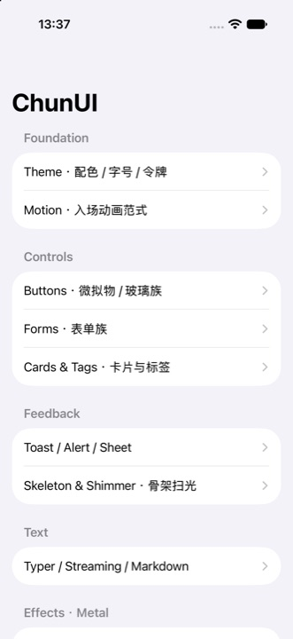
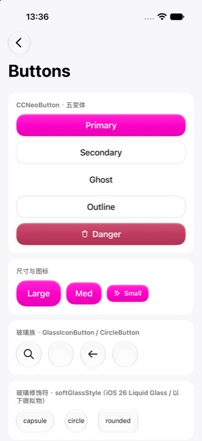
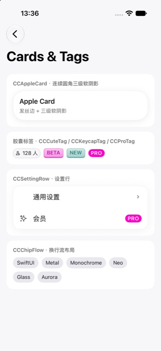
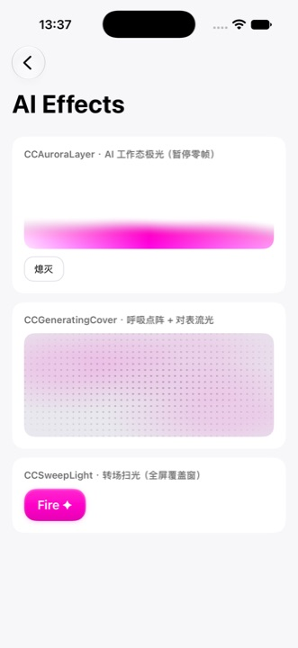
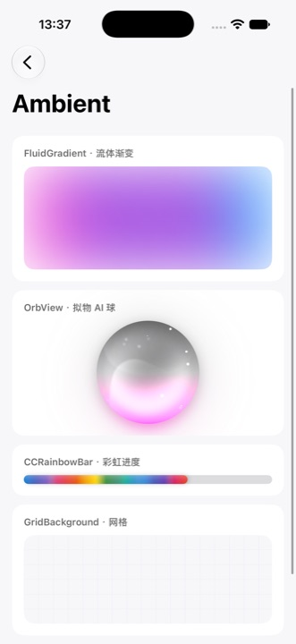
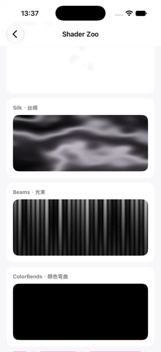

# ChunUI

**Define your palette. Ship the same texture.**

ChunUI 是从生产级 iOS 应用 [Zinner（阿奇）](https://zinnerapp.com) 中提取的 SwiftUI 设计系统——黑白灰阶 + 唯一品牌色的 Monochrome 质感、微拟物按钮、原生 sheet 标准、Metal shader 特效与点阵动画，全家桶开箱即用。

**你只需要定义自己的配色，就能做出同质感的应用。**

<p>
  
</p>

```swift
import ChunUI

// App 启动时，一行换肤
var colors = CCColors.default          // Zinner 同款极致黑白粉
colors.primary = .hex("007aff")        // 换成你的品牌色
ChunUI.configure(colors: colors)

// 之后全组件族自动着装
CCNeoButton("开始", variant: .primary) { await start() }
Text("标题").ccText(font: .cc.lgBold, color: .cc.foreground)
```

## AI Agent Skill

仓库自带 `skills/chunui/` —— 分门别类教 AI 编程助手搭出同级质感：
- `SKILL.md` 入口：架构一图流 + 质感五铁律 + 常见坑
- `usage/` 用法三册：接入换肤 / 呈现层（sheet·toast·alert·zoom）/ 特效动效
- `components/reference.md` 全组件逐类参考
- `examples/` **五个真实生产页面源码**（个人中心/时间线/收银台/AI 分析卡/tabbar）——积木图纸

**Claude Code**：

```bash
# 项目级（推荐，随仓库走）
mkdir -p .claude/skills && cp -R /path/to/ChunUI/skills/chunui .claude/skills/
# 或全局
cp -R /path/to/ChunUI/skills/chunui ~/.claude/skills/
# 或经 skills CLI
npx skills add liseami/ChunUI
```

**Codex / 其他 Agent**：把 `skills/chunui/SKILL.md` 内容追加进项目 `AGENTS.md`（或在其中写一行指引：`ChunUI 用法见 skills/chunui/SKILL.md`）。

**Cursor**：拷入 `.cursor/rules/chunui.mdc`。

安装后，Agent 会在涉及 ChunUI 的任务里自动遵循组件规范与架构铁律。

## 安装

Swift Package Manager，iOS 18.6+（iOS 26 自动启用 Liquid Glass，18.6–25 同形微拟物降级）：

```swift
.package(url: "https://github.com/liseami/ChunUI", branch: "main")
```

## 里面有什么

| 域 | 内容 |
|---|---|
| **Theme** | `CCColors` 语义调色板（shadcn 同构：background/card/panel/muted/accent/destructive…）、`Font.cc` 三梯度字号铁律、`CGFloat.cc` 间距/圆角令牌、`CCMotion` 全局动画曲线（reveal 零过冲 / wave 微过冲错峰） |
| **按钮** | `CCNeoButton` 微拟物五变体×三尺寸（async loading + glow/shake 按压）、`GlassButton`/`MetalGlassButton`/`GlassIconButton` 玻璃族（iOS 26 Liquid Glass / 以下微拟物同形降级） |
| **Sheet 标准** | `AppHelper.presentSheet(.form/.half/.compact/.picker)` 原生 UISheetPresentationController 深度调参：detents/脏态下拉确认/zoom 锚点转场/贴底吞安全区 |
| **Toast / Alert** | `CCToastCenter` 单槽玻璃胶囊 toast（loading 常驻顶换）＋ 沉底双胶囊 Alert（Twitter 风，禁 UIAlert） |
| **特效** | `CCAuroraLayer` AI 工作态极光（Metal）、`CCGeneratingCover` 呼吸点阵生成中质感、`CCFractalFloor` 九分形点阵地板、`CCSweepLight` 转场扫光、`ParticleDissolve` 粒子消散、Holographic/MetaBalls/Silk/Beams/Noise 全套 shader |
| **氛围** | `FluidGradient` 流体渐变、`Orb` 拟物 AI 球（发光/粒子/波浪）、`CCRainbowBar` 彩虹进度、`CCSkeleton` 扫光骨架屏、`StreamingText` 流式打字 |
| **表单/卡片** | `CCInput`/`CCTextArea`/`CCToggle`/`CCCheckbox`/`CCDatePicker`、`CCAppleCard` 连续圆角三级软阴影、`CCCuteTag`/`CCKeycapTag` |
| **图标** | `PikaIcon` —— 1225 枚 24×24 stroke 模板矢量随包分发，可染色可缩放 |
| **基建** | `VariableBlurView` 渐进模糊、`ccFloatingPageHeader` 页面 chrome 范式、相机/相册选择器、`InAppBrowser`、Markdown 渲染 |

## 设计哲学

1. **唯一彩色**：灰阶承载一切层级，品牌色是页面上唯一的彩色——这是同质感的根。
2. **三梯度字号铁律**：全应用只有 sm 13 / base 17 / lg 24 三个字号。
3. **组件级触觉与埋点**：按钮自带按压反馈；`CCTrack.onTap` 接线座让宿主埋点系统零侵入接入。
4. **配置即代码**：`ChunUI.configure(colors:strings:)` 是唯一初始化入口；文案表 `CCStrings` 可整体覆写做本地化。

## 宿主可注入的接线座

```swift
ChunUI.hapticsEnabled = userPrefs.haptics          // 触觉总开关
ChunUI.sheetPresentHook = { _, name in Analytics.page(name) }  // sheet 呈现埋点
CCTrack.onTap = { Analytics.tap($0) }              // 组件级点击埋点
CCImageLoader.custom = { url, _ in                 // 用 Kingfisher 接管网络图
    AnyView(KFImage(url).resizable())
}
AppHelper.toastRouteResolver = { ... }             // toast 气泡路由策略
```

## 依赖

- [Pow](https://github.com/EmergeTools/Pow)（MIT）——按钮 glow/shake 按压质感，唯一第三方依赖。

## 示例 App

`Example/ChunUIGallery.xcodeproj` 是可直接运行的组件画廊（xcodegen 生成，引用本地包）——按 Foundation / Controls / Feedback / Text / Effects / Ambient / Icons 分区展示全部组件与特效。画廊源码在 `Sources/ChunUIDemo/`，同时充当公开 API 面的编译级测试。

```bash
open Example/ChunUIGallery.xcodeproj   # 选模拟器直接 Run
```

## License

MIT.

---

*Extracted with care from Zinner. Texture is a feature.*
